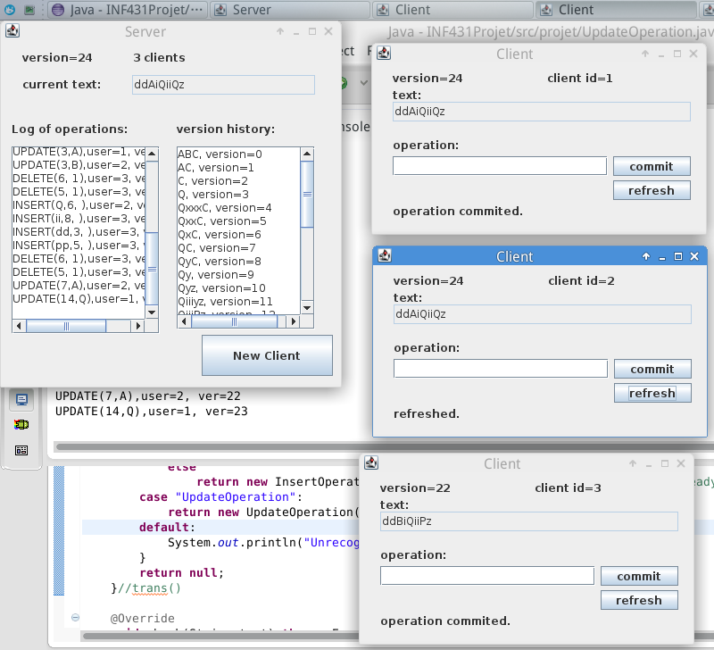

# User Guide

To use our program, import the project into Eclipse, and run the `main` method in `Server.java`, when the server window appears, click the "new client" button to generate some clients, then, at each client's window, input operations you want to perform, then press "commit" button to commit and get the latest version of text from server. 

or you can just press "refresh" button to retrieve the latest version of text from server.

The input operations are in three possible forms:

1. `insert(str,pos)`, where `str` is a string and `pos` is a number indicating the position to insert;

1. `delete(pos,len)`, where `pos` indicates the position from which to delete, and `len` indicates the number of characters to delete;

1. `update(pos,c)`, where `pos` is the position of the character to update, `c` is the new character to replace. 

If input string is not correct, a message will appear at the bottom, and you can input again.

